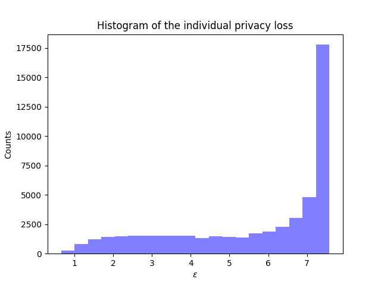
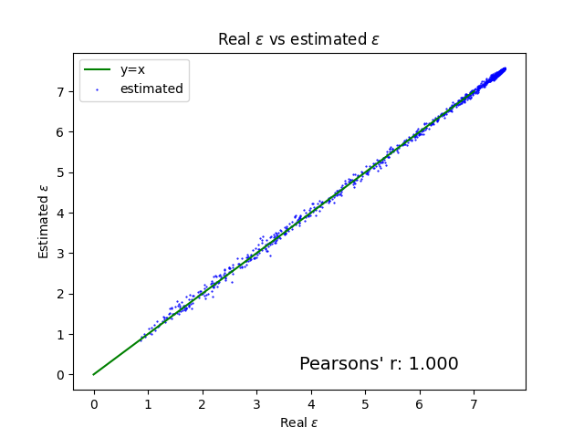

# Individual privacy accounting for DP-SGD

This repo implements the algorithm in [Individual Privacy Accounting for Differentially Private Stochastic Gradient Descent](https://arxiv.org/abs/2206.02617) for training ResNet-20 on CIFAR-10.

## Build the environment
```pip install -r requirements.txt```

## Run DP-SGD with individual privacy accounting 

This command trains a resnet20 model on CIFAR-10. The training takes ~1.5 hours with a single A100 GPU.

```python main.py --private --sess example_exp --sigma 2.2 --n_epoch 200 --clip 15 ```

## Visualize individual privacy parameters

After training, you can visualize the histogram of individual privacy and estimation errors. The figures are saved in the `figs` folder.

```python visualization.py --sess example_exp```


## Figures





